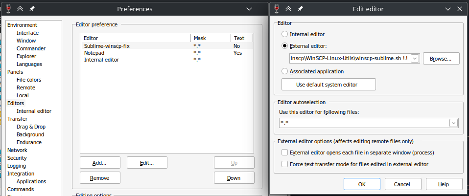
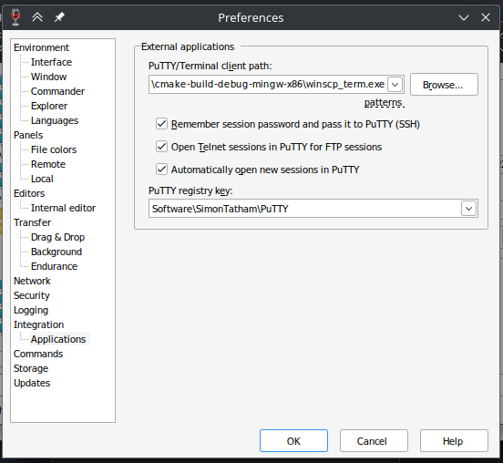

# WinSCP Linux Utils

Set of useful utilities for easier usage of WinSCP on Linux through Wine.

# List of utilities

## winscp-sublime.sh

This bash script serves as proxy app between WinSCP running in Wine, and native Sublime Editor. It reads file path from arguments, change path format from Windows to Linux, and launches Sublime.

### Installation

Clone the repo, create new entry in `Preferences > Editors > Add`, select `External Editor`, and Browse for `winscp-sublime.sh` script.

## winscp-term

This small script serves as proxy app between WinSCP running in Wine, and terminal (in this case KDE's **konsole**), which launches SSH connection to server. On launch, it reads PuTTY registers (created by WinSCP), which contains all information for successful connection to the server.

### Installation

Download prebuilt .exe file from Releases, or compile it by yourself with MinGW. Afterwards, configure `PuTTY-Terminal client path` in `Preferences > Integration > Applications`, by browsing for `winscp-term.exe`.

